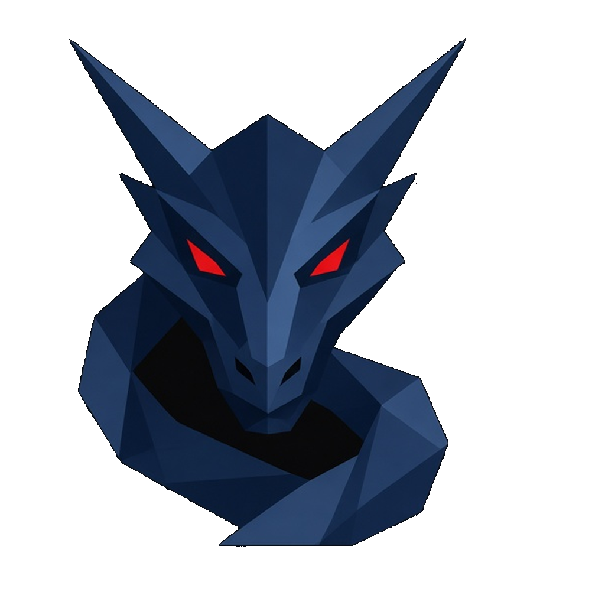

<p align="center">
  
</p>

# Dragon AI

Dragon AI is a desktop AI workspace built around **bot teams**. You chat with a Chief of Staff bot that routes work to specialist bots. Each bot has its own role, skills library, scheduled routines, and an optional VM desktop ("computer") you can watch it work on.

It is a fork of the open-source [Hermes Agent](https://github.com/NousResearch/hermes-agent) framework (MIT), rebranded and extended. Everything a user sees, including the window, tray, installer, CLI messages, and process name, says Dragon AI.

## What's in the app

- **Grok-first onboarding.** Providers are expanded on the first screen, with xAI Grok OAuth (SuperGrok / Premium+) recommended. A confirmation screen shows the connected provider and default model (`grok-4.7`), with **Change** and **Begin** buttons. Begin lands on the Bots tab with the Chief of Staff's screen open.
- **Bots tab.** Pinned bots appear as avatar tiles with a name and role badge, sorted to the top. Double-click any bot to open the right-hand **bot panel**, which has three tabs:
  - **Computer:** the bot's VM desktop.
  - **Library:** the bot's skills.
  - **Details:** the bot's profile and its Routines toggles.
- **Teams Marketplace.** This is the row under the Dragon logo in the sidebar. Install a ready-made team (Real Estate Lead Gen, Marketing, Trading Desk, Engineering, Customer Support, Research) in one click. Each seat becomes a bot with its own persona, role, color, and section in the roster.
- **Duplex voice.** In Settings → Voice → Voice conversation mode, choose **Chained** (speech-to-text, then LLM, then text-to-speech), **GPT-Live**, or **Grok Voice**. Grok Voice uses xAI's realtime voice API and delegates real work back to the agent through an `ask_dragon` tool. A floating waveform widget sits above the composer while a conversation is live.
- **Scheduled jobs.** Opening Scheduled Jobs keeps the right sidebar visible.
- **Telemetry.** Dragon AI never prompts you to share usage metrics. The opt-in lives in Settings → Safety and is off by default.

## Requirements

- Node.js `^22.22`, `^24.11`, or `>=26`
- Linux, macOS, or Windows (Windows installers are built on a Windows host)
- An AI provider. SuperGrok / X Premium+ OAuth is recommended. `XAI_API_KEY`, or any provider Hermes supports, also works.

## Run it locally

```bash
# 1. Backend: pm-managed Python environment (uv + pinned interpreter)
export HERMES_HOME="$HOME/.dragon-ai"
./setup-hermes.sh
source ./activate

# 2. Desktop app
npm install
cd apps/desktop
npm run dev          # Vite renderer on http://127.0.0.1:5174, then Electron
```

The desktop app starts its own backend process and keeps all state in `~/.dragon-ai` (Windows: `%LOCALAPPDATA%\DragonAI\home`). On first launch you'll go through onboarding. Pick **xAI Grok OAuth**, sign in, confirm the model, and press **Begin**.

If you still have a leftover `%LOCALAPPDATA%\DragonAIClaude\home` from v0.2, the app moves it to `%LOCALAPPDATA%\DragonAI\home` on first launch (rename when possible, otherwise a copy). A `MOVED_TO.txt` pointer is left next to the old folder. One-shot manual move if you prefer:

```powershell
Move-Item -LiteralPath "$env:LOCALAPPDATA\DragonAIClaude\home" -Destination "$env:LOCALAPPDATA\DragonAI\home"
```

The CLI is also available as `dragon` (for example `dragon model` or `dragon auth add xai-oauth`).

## Build installers

From `apps/desktop`:

| Target  | Command              | Output                                             |
| ------- | -------------------- | -------------------------------------------------- |
| Windows | `npm run dist:win`   | One `DragonAIAgent-Setup-<version>-<arch>.exe` (NSIS) |
| macOS   | `npm run dist:mac`   | `.dmg` and `.zip`                                  |
| Linux   | `npm run dist:linux` | AppImage, `.deb`, `.rpm`                           |

The Windows installer is a single self-contained Setup `.exe`. It lets you choose the install directory, creates a Start-menu shortcut named **Dragon AI**, and launches the app when it finishes. Default install folder is `%LOCALAPPDATA%\Programs\Dragon AI`. `npm run dist:win:msix` still builds an MSIX package if you need one.

### Getting a new `DragonAIAgent-Setup-*.exe` from CI

Windows NSIS is produced by **Desktop Bundled Release** (`.github/workflows/desktop-bundled-release.yml`). After this branch is on the default branch, Cos/James can:

1. Actions → **Desktop Bundled Release** → **Run workflow**
2. Set `build_commit` to the full 40-character SHA (mutually exclusive with `tag`)
3. Optionally set `jobs` to `win32-x64` if only the living-room x64 Setup exe is needed
4. Download `DragonAIAgent-Setup-<version>-x64.exe` from the run's staged R2/commit output (commit builds do **not** publish a GitHub Release)

A Windows host can also build locally: `cd apps/desktop && npm run dist:win`. That writes the Setup exe under `apps/desktop/release/`.

## Tests and checks

```bash
# Python
HERMES_HOME=$HOME/.dragon-ai scripts/run_tests.sh tests/tools tests/agent

# Desktop
cd apps/desktop
npm run typecheck
npm run lint
npx vitest run
```

## Updates and upstream sync

Users get updates **only from this repository**. The desktop app, CLI (`dragon update`), and ZIP fallback all read one feed file: [`branding/product-feed.json`](branding/product-feed.json). That file names `ShengLong76/Dragon-AI-Agent` as the product repository. `NousResearch/hermes-agent` is recorded there as upstream for maintainers, never as an in-app update source.

```
Hermes upstream → sync PR (weekday schedule or manual) → James approves
  → main → Dragon release (Desktop Bundled Release / installer) → Dragon updater
```

- **Upstream sync.** `.github/workflows/dragon-upstream-sync.yml` fetches Hermes's default branch, merges it onto `dragon/upstream-sync` (cut from Dragon `main`), reapplies branding, and opens or updates a pull request. It never auto-merges. If Git reports conflicts, the PR is opened as a draft and lists the conflicting files. Protected Dragon paths (logo, `apps/desktop/src/dragon/`, installer identity, this README) are called out when upstream touched them.
- **Branding guard.** `python3 scripts/dragon/branding_guard.py` fails CI when user-visible Hermes naming returns. LICENSE / MIT attribution and internal upstream-remote references are allowed.
- **Release.** After a sync PR (or any change) lands on `main`, the existing Desktop Bundled Release / canary pipeline publishes a Dragon release. Release notes are written as Dragon AI notes (`scripts/release.py`) and summarise reviewed main — they are not a raw Hermes autofix feed.
- **In-app updater.** Packaged builds publish to GitHub Releases on `ShengLong76/Dragon-AI-Agent`. Source installs follow this repo (or their own GitHub fork). A leftover Hermes `origin` or `upstream` remote is ignored and remapped to Dragon.

```bash
python3 scripts/dragon/rebrand_strings.py           # rewrite in place
python3 scripts/dragon/rebrand_strings.py --check   # fail if any visible upstream naming remains
python3 scripts/dragon/branding_guard.py            # feed + visible-copy + rebrand check
```

Dragon-specific code lives in `apps/desktop/src/dragon/` (brand, theme, Teams Marketplace) and `apps/desktop/src/plugins/hermes-bots/` (bot panel, pinned tiles, roster). Internal module names (`hermes_cli`, `tui_gateway`, …) stay so upstream merges cleanly.

## Known limits

- The hands-free wake word is a bundled on-device model trained on the phrase "hey hermes". Rebranding it needs a newly trained model, so the phrase is unchanged for now.
- On Windows, the backend's console shim is still named `hermes.exe`. The updater and process-cleanup code match on that name.

## License

MIT. See [LICENSE](LICENSE). Includes Hermes Agent © Nous Research, used under the MIT license.
